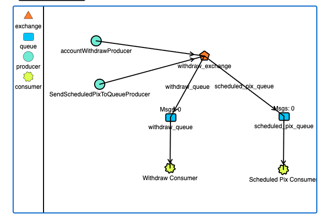

# Withdraw PIX API

API responsável por realizar o transações PIX.


## Sumário

- [Tecnologias usandas](#tecnologias-usadas)
- [Arquitetura](#arquitetura)
- [Diagrama C4](#diagrama-c4)
- [Fluxo de mensageria](#fluxo-de-mensageria)
- [Rodando o projeto](#rodando-o-projeto)
- [Endpoints](#endpoints)


### Tecnologias usadas

- `Hyperf/PHP`: API densenvolvida com o framework Hyperf
- `RabbitMQ`: Usanda para armazenar todos os eventos de sucesso e erro garantindo maior entrega de notificação.
- `MailHog` Serviço para notificação das transações via e-mail.

### Arquitetura

### Diagrama C4


### Fluxo de mensageria



### Rodando o Projeto

O projeto foi desenvolvido usando o `Docker` e para sua execução é necessário o `Docker` e `docker-compose` previamente
instalados na maquina local.

#### Buildando a aplicação

Para realizar o build da aplicação basta rodar o comando abaixo:

```
docker compose build
```

#### Para subir todos os containers da aplicação basta rodar o comando

```
docker compose up -d
```

O arquivo `.env.example` contém todas as variáveis necessárias para o funcionamento da aplicação.

```
APP_NAME=skeleton
APP_ENV=dev

DB_DRIVER=mysql
DB_HOST=withdraw-pix-db
DB_PORT=3306
DB_DATABASE=withdraw_pix
DB_USERNAME=root
DB_PASSWORD=root
DB_CHARSET=utf8mb4
DB_COLLATION=utf8mb4_unicode_ci
DB_PREFIX=

REDIS_HOST=redis
REDIS_AUTH=(null)
REDIS_PORT=6379
REDIS_DB=0

AMQP_HOST=rabbitmq
RABBITMQ_QUEUE_CONNECTION=default
AMQP_PORT=5672
AMQP_USER=guest
AMQP_PASSWORD=guest
AMQP_VHOST=/

MAIL_MAILER=smtp
MAIL_HOST=mailhog
MAIL_PORT=1025
MAIL_USERNAME=null
MAIL_PASSWORD=null
MAIL_ENCRYPTION=""
MAIL_FROM_ADDRESS="noreply@test.co"
MAIL_FROM_NAME="${APP_NAME}"
```

### Endpoints

Abaixo está disponibilizado o Curl dos endpoints da aplicação.

- Endpoint facilitados para criação de contas 
```
curl --location 'http://localhost:9501/v1/account' \
--header 'Content-Type: application/json' \
--data '{
    "name": "JOSE Maria"
}'
```

- Endpoint para criação de uma nova transação

```
curl --location 'http://localhost:9501/v1/account/bc6d82f7-eaac-4694-8110-53bdd8fd633e/balance/withdraw' \
--header 'Content-Type: application/json' \
--data-raw '{
    "method": "PIX",
    "pix": {
        "type": "email",
        "key": "andreluizmicro@gmail.com"
    },
    "amount": 24.00,
    "schedule": "2025-10-08"
}'
``` 